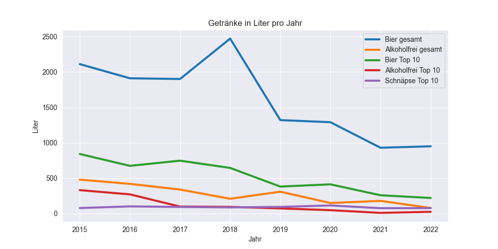
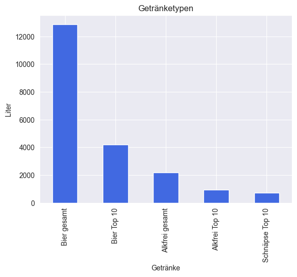

# Hut-statistics | Hüttenstatistiken

Dieses Repository enthält eine Analyse der jährlichen Hüttenstatistiken.

## Daten
Die Daten stammen von den jährlich herausgegebenen Statistiken der Hütte. Der Datensatz beginnt im Jahr 2015 und wird jedes Jahr erweitert. Aktuell sind die Daten bis zum Jahr 2022 enthalten.

Der Datensatz enthält die folgenden drei Tabellen:
- Alle Biersorten🍺 und alkoholfreien Getränke🍹
- Top 10🔝 Biertrinker
- Top 10🔝 Schnapstrinker

Zudem werden für eine Anlayse auch Indizes verwendet. Diese stammen von [Statista](https://de.statista.com/).

## Analyse 📊
⚠️ Vorab ersteinmal, ich kann  Fehler gemacht haben, sowohl bei der Erstellung des Datensatzes als auch bei der Analyse. Es ist für mich ein Hobbyprojekt. Die komplette Analyse finden Sie [hier](https://htmlpreview.github.io/?https://github.com/Chrissi2802/Hut-statistics/blob/main/hut_statistics_eda_ml_encoded.html).

### Erster Einblick

Ein fallender Trend 📉 ist deutlich zu erkennen. Der Verzehr von Getränken ist in den letzten Jahren rückläufig.

Bier🍺 ist mit Abstand das beliebteste Getränk. Es wird mehr Bier getrunken als alle anderen Getränke zusammen.

### Vorgehen
Ich bin jede der drei Tabellen der Reihe nach durchgegangen und habe Analysen durchgeführt. Anschließend habe ich noch die Kombination aus den drei Tabellen betrachtet. Zudem habe ich Kommentare nach einigen Plots hinterlassen, was ich daraus erkennen kann.
Alle Diagramme die in der Analyse enthalten sind, sind gespeichert und können im Ordner [Plots](Plots) einzeln betrachtet werden.

## Machine Learning ✨
Im Anschluss an die Analyse habe ich mir noch Gedanken gemacht, was ich noch mit den Daten anstellen kann.
Ich habe eine Vorhersage implementiert, die zu jedem Getränketyp die Literanzahl für das nächste Jahr vorhersagt.
Die Vorhersage funktioniert nicht perfekt, aber der Trend ist erkennbar.

### Entwicklung
- [Visual Studio Code](https://code.visualstudio.com/)
- Unterstützung durch [GitHub Copilot](https://github.com/features/copilot)
- [Python](https://www.python.org/downloads/) 3.10.9

## Übersicht über die Datei- und Ordnerstruktur 📁
| Dateien                         | Beschreibung                                                        |
| ------------------------------- | ------------------------------------------------------------------- |
| [Plots](Plots)                  | Ordner enthält gespeicherte Plots                                   |
| [hut_statistics_eda_ml_encoded.html](https://htmlpreview.github.io/?https://github.com/Chrissi2802/Hut-statistics/blob/main/hut_statistics_eda_ml_encoded.html)     | HTML Datei des Jupyter notebooks der Explorativen Datenanalyse und des Machine Learnings mit den chiffrierten Namen   |
| [hut_statistics_eda_ml.ipynb](hut_statistics_eda_ml.ipynb)   | Jupyter notebook der Explorativen Datenanalyse und des Machine Learnings  |
| [utils.py](utils.py)            | Funktionen um den Datensatz zu laden,  die Namen zu chiffrieren und Vorhersagen zu treffen   |

Viel Spaß beim lesen!😊

## Lizenz
Dieses Projekt ist unter der Apache-2.0-Lizenz lizenziert.
